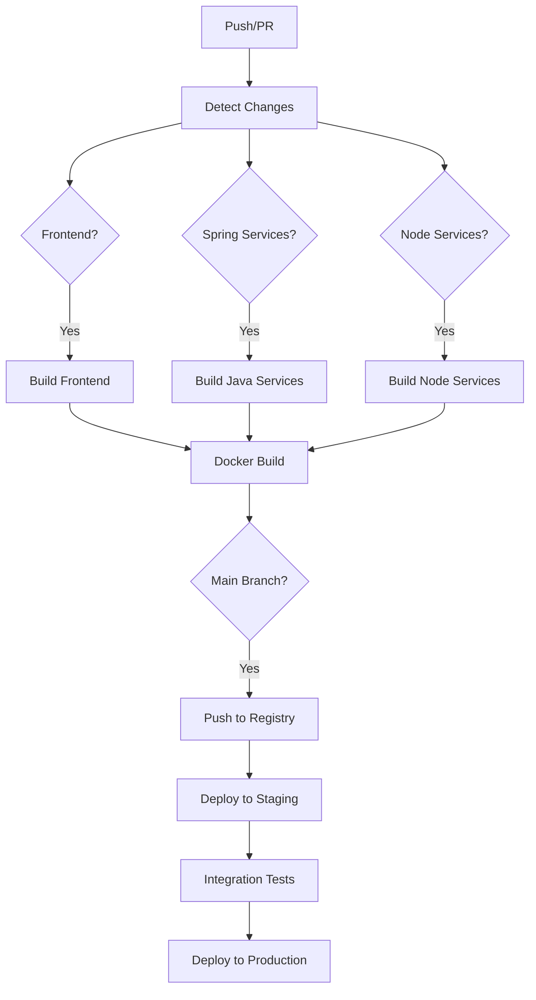

# CI/CD con GitHub Actions

## Descripción General

El proyecto utiliza GitHub Actions para implementar un pipeline completo de CI/CD que incluye:

- ✅ **Detección inteligente de cambios** por servicio
- 🏗️ **Build paralelo** de componentes modificados
- 🧪 **Testing automatizado** (unitarios, integración, seguridad)
- 🐳 **Containerización** con Docker
- 🚀 **Deployment automático** a staging/production
- 📊 **Monitoreo** y health checks

## Workflows Configurados

### 1. **ci-cd.yml** - Pipeline Principal
- **Trigger**: Push a `main`/`develop`, Pull Requests
- **Funcionalidades**:
  - Detecta cambios por servicio/directorio
  - Solo ejecuta builds para componentes modificados
  - Builds paralelos para optimizar tiempo
  - Push de imágenes Docker a GitHub Container Registry
  - Deploy automático en `main` branch

### 2. **pr-validation.yml** - Validación de PRs
- **Trigger**: Pull Requests
- **Funcionalidades**:
  - Validación de calidad de código
  - Tests unitarios completos
  - Security scanning con Trivy
  - Lint de commit messages

### 3. **release.yml** - Pipeline de Release
- **Trigger**: Tags `v*` (ej: `v1.0.0`)
- **Funcionalidades**:
  - Crear release en GitHub
  - Build y tag de imágenes con versión
  - Deploy a producción

### 4. **dependency-updates.yml** - Actualizaciones
- **Trigger**: Scheduler (semanal) o manual
- **Funcionalidades**:
  - Actualización automática de dependencias npm/maven
  - Creación de PRs automáticos

### 5. **health-monitoring.yml** - Monitoreo
- **Trigger**: Scheduler (cada 15 min) o manual
- **Funcionalidades**:
  - Health checks de servicios
  - Tests de performance
  - Notificaciones en Slack

## Configuración por Servicio

### Frontend (Angular)
```yaml
- Lint con ESLint
- Tests con Karma/Jest
- Build optimizado para producción
- Imagen Docker con Nginx
```

### Servicios Spring Boot
```yaml
- Tests con JUnit/Mockito
- Build con Maven
- Imagen Docker con OpenJDK
- Health checks con Actuator
```

### Notification Service (Node.js)
```yaml
- Tests con Jest
- Build con npm
- Imagen Docker con Node.js
```

## Optimizaciones Implementadas

### 🚀 **Performance**
- **Builds paralelos** por matriz de servicios
- **Cache** de dependencias (npm, maven, docker layers)
- **Detección de cambios** para evitar builds innecesarios

### 🔒 **Seguridad**
- **Imágenes base** actualizadas y seguras
- **Usuarios no-root** en containers
- **Security scanning** con Trivy
- **Secrets** gestionados por GitHub

### 📊 **Observabilidad**
- **Health checks** en containers
- **Monitoring** continuo
- **Métricas** de performance
- **Notificaciones** automáticas

## Configuración Necesaria

### GitHub Secrets
```
SLACK_WEBHOOK         # Para notificaciones
DOCKER_PASSWORD       # Si usas Docker Hub
KUBE_CONFIG          # Para deployment a Kubernetes
```

### GitHub Environments
- `staging` - Ambiente de testing
- `production` - Ambiente productivo

### Container Registry
- Usa **GitHub Container Registry** (ghcr.io)
- Imágenes se tagean con:
  - `latest` para main branch
  - `SHA` para cada commit
  - `v1.0.0` para releases

## Pipeline Flow



## Comandos Útiles

```bash
# Trigger manual de workflows
gh workflow run ci-cd.yml

# Ver status de workflows
gh run list

# Ver logs de un run específico
gh run view [RUN_ID] --log

# Crear release
git tag v1.0.0
git push origin v1.0.0
```

## Monitoreo y Alertas

- **Health checks** cada 15 minutos
- **Alertas Slack** en caso de fallos
- **Performance monitoring** con métricas
- **Deployment notifications**

La configuración está diseñada para ser **escalable**, **eficiente** y **segura**, aprovechando las mejores prácticas de DevOps para monorepos.
